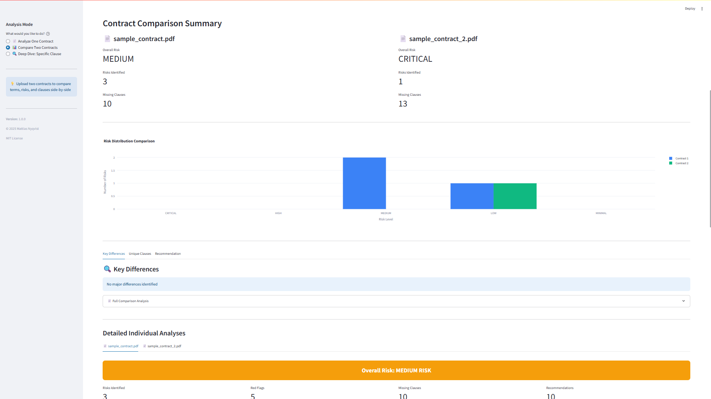
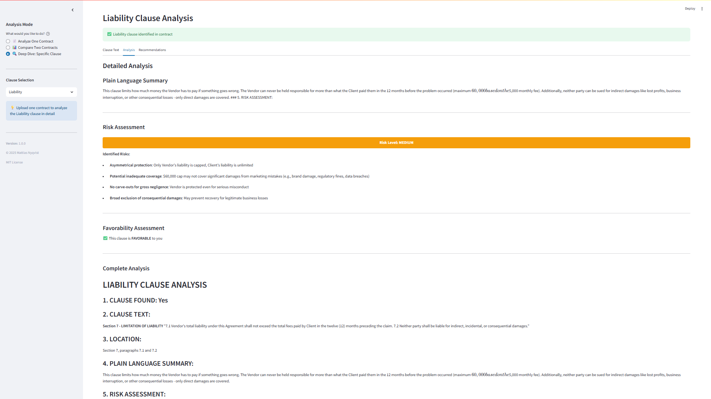
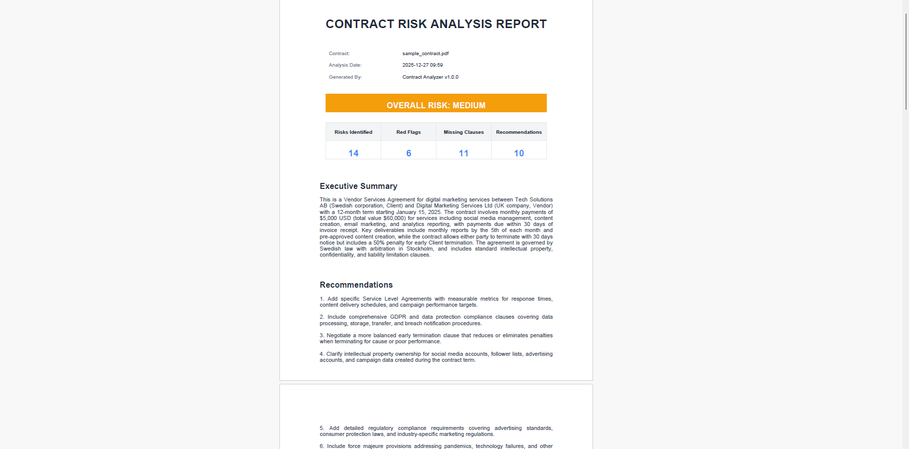
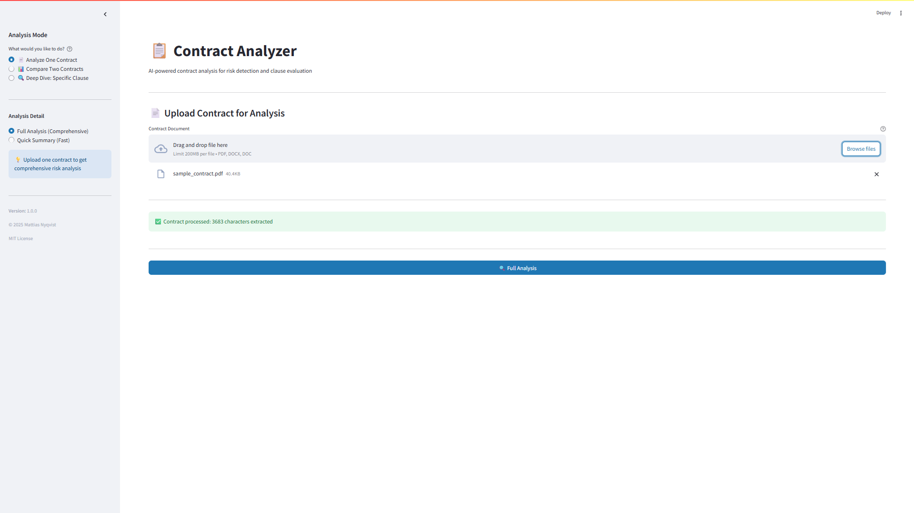
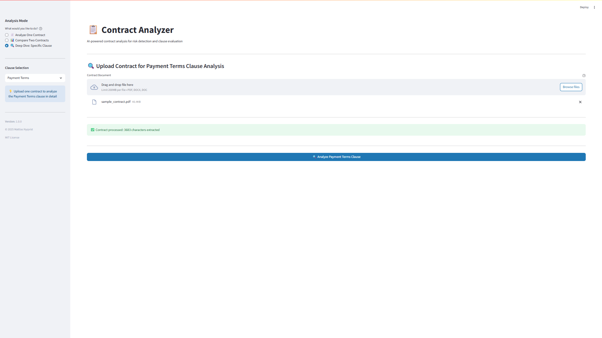

# Contract Analyzer

[](https://opensource.org/licenses/MIT)
[](https://www.python.org/downloads/)
[](https://streamlit.io)
[](https://www.anthropic.com)
[](https://www.reportlab.com/)
[](https://plotly.com/)
[](https://github.com/psf/black)
[](https://github.com/YOUR_USERNAME/contract-analyzer/graphs/commit-activity)
[](http://makeapullrequest.com)
[](https://github.com/YOUR_USERNAME/contract-analyzer/commits/main)

AI-powered contract analysis tool for risk detection, clause evaluation, and comprehensive legal document review.


## Features

### Core Analysis
- **AI-Powered Risk Detection** - Uses Claude Sonnet 4 to identify potential legal and business risks
- **Executive Summaries** - Comprehensive 4-6 sentence overview of contract essentials
- **Risk Categorization** - Automatically classifies risks by severity (CRITICAL/HIGH/MEDIUM/LOW/MINIMAL)
- **Missing Clause Detection** - Identifies important missing provisions
- **Red Flag Identification** - Highlights unusual or unfavorable terms
- **Actionable Recommendations** - Specific suggestions for contract improvements

### WOW Features

#### 1. Contract Comparison Mode
Compare two contracts side-by-side to identify differences and determine which is more favorable.



**Features:**
- Side-by-side risk analysis
- Visual risk distribution charts
- Key differences identification
- Unique clause detection
- "Which is better?" AI recommendation
- Individual detailed analyses for each contract

#### 2. Clause-by-Clause Deep Dive
Deep analysis of specific contract clauses with expert insights.



**Supported Clauses:**
- Payment Terms
- Liability
- Termination
- Confidentiality
- Intellectual Property
- Warranties
- Indemnification
- Dispute Resolution
- Force Majeure
- Non-Compete
- Governing Law

**Analysis Includes:**
- Exact clause text extraction with location
- Plain language summary
- Risk assessment specific to clause
- Favorability rating (Favorable/Neutral/Unfavorable)
- Clause-specific recommendations
- Guidance when clause is missing

#### 3. Professional PDF Export
Generate beautifully formatted PDF reports ready to share with stakeholders.



**PDF Contents:**
- Color-coded risk badges
- Comprehensive metrics table
- Executive summary
- Detailed risk assessment
- Red flags and missing clauses
- Professional typography and layout

### Additional Features
- **Multi-Format Support** - PDF, DOCX, DOC file uploads
- **Export Options** - TXT, HTML, and PDF report formats
- **Automated Fallback** - Works without API key using rule-based analysis
- **Clean Modern UI** - Professional light theme with intuitive navigation
- **Mode-Based UX** - Clear separation between analysis types

## Getting Started

### Prerequisites
- Python 3.8+
- Anthropic API key (optional for AI features)

### Installation

1. **Clone the repository**
```bash
git clone https://github.com/YOUR_USERNAME/contract-analyzer.git
cd contract-analyzer
```

2. **Create virtual environment**
```bash
python -m venv venv
venv\Scripts\activate  # Windows
# source venv/bin/activate  # Mac/Linux
```

3. **Install dependencies**
```bash
pip install -r requirements.txt
```

4. **Configure API key**
Create `.env` file:
```
ANTHROPIC_API_KEY=your_api_key_here
```

Get your API key from: https://console.anthropic.com/

5. **Run the application**
```bash
streamlit run app.py
```

Open http://localhost:8501 in your browser.

## Usage

### Single Contract Analysis

1. Select **"Analyze One Contract"** mode
2. Choose analysis detail (Full Analysis or Quick Summary)
3. Upload your contract (PDF/DOCX)
4. Click **"Analyze Contract"**
5. Review results and download reports



### Contract Comparison

1. Select **"Compare Two Contracts"** mode
2. Upload both contracts
3. Click **"Compare Contracts"**
4. Review side-by-side comparison
5. See which contract is more favorable


### Clause Deep Dive

1. Select **"Deep Dive: Specific Clause"** mode
2. Choose clause type (e.g., Payment Terms)
3. Upload contract
4. Click **"Analyze [Clause Type] Clause"**
5. Review detailed clause analysis



## Technology Stack

### Core Technologies
- **Python 3.8+** - Primary language
- **Streamlit** - Web application framework
- **Anthropic Claude API** - AI-powered analysis (Sonnet 4)

### Document Processing
- **PyPDF2** - PDF text extraction
- **pdfplumber** - Advanced PDF parsing
- **python-docx** - Word document handling

### Data & Visualization
- **Pandas** - Data manipulation
- **Plotly** - Interactive charts and graphs

### Report Generation
- **ReportLab** - Professional PDF generation
- **Custom HTML templates** - HTML reports

### Additional Libraries
- **python-dotenv** - Environment variable management
- **Pillow** - Image processing
- **openpyxl** - Excel support

## Project Structure
```
contract-analyzer/
├── app.py                      # Main Streamlit application
├── version.py                  # Version info and metadata
├── requirements.txt            # Python dependencies
├── .env.example               # Environment variables template
├── .gitignore                 # Git ignore rules
│
├── config/
│   ├── settings.py            # App configuration
│   └── prompts.py             # AI prompts for analysis
│
├── modules/
│   ├── contract_analyzer.py   # AI contract analysis
│   ├── contract_comparator.py # Contract comparison logic
│   ├── clause_finder.py       # Clause extraction & analysis
│   ├── file_handler.py        # File upload handling
│   ├── text_extractor.py      # PDF/DOCX text extraction
│   ├── risk_detector.py       # Automated risk detection
│   ├── report_builder.py      # TXT/HTML report generation
│   └── pdf_generator.py       # PDF report generation
│
├── ui/
│   ├── sidebar.py             # Sidebar components
│   ├── results_display.py     # Analysis results UI
│   ├── comparison_view.py     # Comparison results UI
│   └── clause_view.py         # Clause analysis UI
│
├── utils/
│   ├── session_manager.py     # Session state management
│   └── validators.py          # Input validation
│
├── data/
│   └── sample_contract.pdf    # Sample contract for testing
│
└── docs/
    └── screenshots/           # Application screenshots
```

## Use Cases

- **Legal Review** - Initial contract assessment before lawyer review
- **Vendor Evaluation** - Compare multiple vendor agreements
- **Risk Management** - Identify potential legal and financial risks
- **Negotiation Prep** - Understand weak points before negotiations
- **Compliance Check** - Verify presence of required clauses
- **Educational** - Learn about contract structures and clauses

## Limitations

- **Not Legal Advice** - This tool provides analysis, not legal counsel
- **AI Variability** - Results may vary slightly between runs
- **English Only** - Currently optimized for English contracts
- **API Required** - Full AI features require Anthropic API key
- **File Size** - Works best with contracts under 50 pages

## Privacy & Security

- **Local Processing** - Text extraction happens locally
- **API Only** - Only contract text sent to Anthropic API
- **No Storage** - Contracts not stored on servers
- **Session-Based** - Data cleared when browser closed
- **Open Source** - All code available for review

## Contributing

Contributions welcome! Please feel free to submit a Pull Request.

## License

This project is licensed under the MIT License - see the LICENSE file for details.

## Author

**Mattias Nyqvist**
- Portfolio: [Coming Soon]
- LinkedIn: [Your LinkedIn]
- GitHub: [@YOUR_USERNAME](https://github.com/YOUR_USERNAME)

## Acknowledgments

- Anthropic for Claude API
- Streamlit for the amazing framework
- ReportLab for PDF generation capabilities

## Version History

### v1.0.0 (2025-12-27)
- Initial release
- Core contract analysis features
- Contract comparison mode
- Clause-by-clause deep dive
- Professional PDF export
- Multi-format support (PDF, DOCX, DOC)
- Export to TXT, HTML, and PDF

---

**Built with care for better contract analysis**